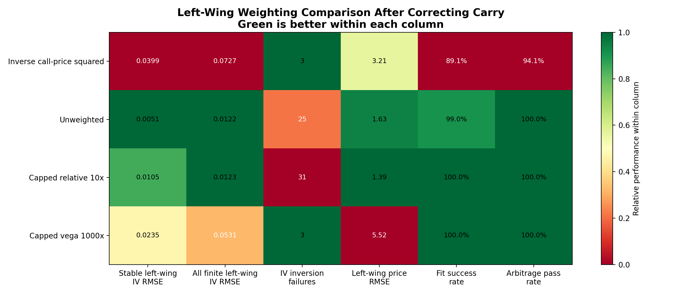
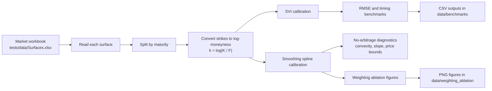

# IVS Calibration

This project calibrates implied volatility surfaces from option market data. It compares two modelling approaches:

- **SVI**, a five-parameter model often used to describe volatility smiles.
- **No-arbitrage cubic smoothing splines**, a flexible curve-fitting method based on Fengler's option-price constraints.

The aim is to take observed option data, fit smooth volatility curves across strikes and maturities, and then check whether the fitted curves are accurate and financially sensible.

The most useful parts to run are the plotting tools:

- the **interactive CLI plot menu**, which lets you choose a surface, method, expiry, and plot type;
- the **report figure generator**, which recreates the saved weighting-ablation figures.

## What to Look For

The main outputs are visual rather than a single final number. The plots are intended to show:

- how SVI and cubic splines fit individual volatility smiles;
- how the fitted surfaces behave across all maturities;
- whether spline weighting choices improve or worsen the left wing of the smile;
- whether the fitted curves remain smooth and visually sensible.

The benchmark CSV files in `data/benchmarks/` record RMSE and runtime for optimiser comparisons. The saved figures in `data/weighting_ablation/` are the quickest way to inspect the spline weighting results.

## Quick Start on Mac using VS Code

Follow these steps to set up and run the project on macOS using Visual Studio Code. The commands are run in VS Code's built-in Terminal.

### 1. Install Visual Studio Code

Download and install VS Code from:

```text
https://code.visualstudio.com/
```

Once VS Code is installed, open it and install the **Python** extension from Microsoft. This makes it easier to inspect the code, use the project environment, and run Python files.

### 2. Install command-line tools

Open the macOS **Terminal** app once and run:

```bash
xcode-select --install
```

If macOS says the tools are already installed, that is fine.

### 3. Install Homebrew, Python, and Poetry

If Homebrew is not installed, install it with:

```bash
/bin/bash -c "$(curl -fsSL https://raw.githubusercontent.com/Homebrew/install/HEAD/install.sh)"
```

Then install Python and Poetry:

```bash
brew install python@3.13 poetry
```

Check the versions:

```bash
python3.13 --version
"$(brew --prefix)/bin/poetry" --version
```

The commands below use `$(brew --prefix)/bin/poetry` instead of plain `poetry`. This makes sure macOS uses the Poetry installed by Homebrew, even if there is an older Poetry install elsewhere on the machine.

This project requires **Python 3.11, 3.12, or 3.13**. The setup below uses Homebrew's Python 3.13 and Poetry 2.x.

### 4. Get the project files

If using Git, run:

```bash
git clone https://github.com/CameronTurner10/IVS_Calibration.git
```

If Terminal says `destination path 'IVS_Calibration' already exists`, the folder is already there and does not need to be cloned again.

If the project was downloaded as a ZIP instead, unzip it.

### 5. Open the project in VS Code

Open VS Code, then use:

```text
File -> Open Folder...
```

Select the `IVS_Calibration` folder.

Then open the VS Code Terminal:

```text
Terminal -> New Terminal
```

The terminal at the bottom of VS Code should be inside the project folder. If it is not, run:

```bash
cd IVS_Calibration
```

### 6. Install the project dependencies

In the VS Code Terminal, tell Poetry to use the Mac Python installation, then install everything:

```bash
"$(brew --prefix)/bin/poetry" env use "$(brew --prefix)/bin/python3.13"
"$(brew --prefix)/bin/poetry" install
```

Poetry creates a private virtual environment for the project. This keeps the project dependencies separate from the rest of the Mac.

If VS Code asks which Python interpreter to use, choose the Poetry environment for this project. If it does not ask, the project can still be run from the VS Code Terminal using the commands below.

### 7. Confirm the project works

In the VS Code Terminal, run the automated tests:

```bash
"$(brew --prefix)/bin/poetry" run pytest
```

Expected result:

```text
13 passed
```

## Reproduce and Inspect the Plots

After setup, these are the main commands to use.

### 1. Open the interactive plotting CLI

```bash
"$(brew --prefix)/bin/poetry" run python -m src.utils.plotting
```

This launches a Terminal menu for exploring the volatility surfaces without editing the code.

The menu flow is:

1. Choose a surface from `tests/data/Surfaces.xlsx`.
2. Choose a method:
   - `1` = SVI
   - `2` = Cubic Splines
   - `3` = Compare SVI against Cubic Splines
3. Choose what to plot:
   - a numbered expiry for one maturity slice,
   - `0` for all maturity slices,
   - `H` for a heatmap,
   - `S` for a full surface plot,
   - `E` for an SVI error plot.
4. Choose the plot scale:
   - `1` = total variance,
   - `2` = implied volatility.

For cubic splines, the CLI also asks whether to use the current default spline fit or compare weighting methods.

Useful walkthroughs:

- **Compare SVI and splines on a surface:** run the CLI, choose a surface, select `3`, then choose `S` for a surface comparison.
- **Inspect a single fitted smile:** run the CLI, choose a surface, choose method `1`, `2`, or `3`, then select a numbered expiry.
- **Compare spline weighting choices:** run the CLI, choose method `2`, select `2` for "Compare weightings", then choose a slice, all slices, heatmap, or surface.

Matplotlib opens the plots in separate windows. Close a plot window to return to the Terminal or finish the command.

### 2. Regenerate the saved report figures

```bash
"$(brew --prefix)/bin/poetry" run python -m src.smoothing_spline.testing.weighting_ablation
```

This recreates the PNG figures in:

```text
data/weighting_ablation/
```

The generated figures are:

- `executive_ablation_matrix.png`
- `sample_slice_before_after_matrix.png`
- `surface4_weighting_ablation_matrix.png`
- `surface4_unweighted_all_maturities.png`
- `surface4_weighted_all_maturities.png`

Example output:



### 3. Where plot outputs live

Interactive CLI plots are displayed on screen. The weighting-ablation script saves figures to `data/weighting_ablation/`.

Benchmark CSVs, if regenerated, are saved to `data/benchmarks/`.

## Project Map

```text
IVS_Calibration/
|-- pyproject.toml                  Project and dependency definition for Poetry
|-- poetry.lock                     Exact dependency versions for reproducibility
|-- tests/data/Surfaces.xlsx        Market data used by the tests and experiments
|-- tests/                          Automated checks for pricing, IV, SVI, and splines
|-- data/benchmarks/                Saved benchmark CSV outputs
|-- data/weighting_ablation/        Saved report figures
`-- src/
    |-- svi/                        SVI model, optimisers, arbitrage checks, benchmarks
    |-- smoothing_spline/           Cubic smoothing spline model and diagnostics
    |-- utils/                      Black-Scholes, implied-vol root finder, plotting tools
    `-- ivs_calibration/            Early top-level wrapper code
```

## How the Work Flows

The diagram below renders interactively in GitHub and many Markdown viewers.



In plain English:

1. The Excel workbook contains option data for several volatility surfaces.
2. Each surface is split into maturity slices.
3. For SVI, the code fits parameters `a`, `b`, `rho`, `m`, and `sigma`.
4. For splines, the code fits option prices directly while enforcing no-arbitrage constraints.
5. Results are judged using error metrics, runtime, and arbitrage diagnostics.

## Additional Reproducibility Commands

All commands below should be run from the project root folder.

### A. Run the test suite

```bash
"$(brew --prefix)/bin/poetry" run pytest
```

This checks:

- Black-Scholes and implied-volatility calculations.
- SVI formula behaviour.
- Spline matrix construction.
- Spline boundary and arbitrage diagnostic logic.

### B. Reproduce the local SVI optimiser benchmark

```bash
"$(brew --prefix)/bin/poetry" run python -m src.svi.testing.benchmark_local_optimizers local_rerun
```

This compares local SVI optimisers:

- SLSQP
- trust-constr
- COBYQA

It writes a CSV file to:

```text
data/benchmarks/local_optimizers_RMSE_local_rerun.csv
```

### C. Reproduce the global SVI optimiser benchmark

```bash
"$(brew --prefix)/bin/poetry" run python -m src.svi.testing.benchmark_global_optimizers global_rerun
```

This compares global SVI optimisers:

- differential evolution
- SHGO
- basin hopping
- dual annealing

It writes a CSV file to:

```text
data/benchmarks/global_optimizers_RMSE_global_rerun.csv
```

This step can take longer than the local optimiser benchmark because global optimisers search more of the parameter space.

### D. Reproduce the combined SVI pipeline comparison

```bash
"$(brew --prefix)/bin/poetry" run python -m src.svi.testing.prototype_pipeline
```

This runs a two-stage calibration:

1. A global optimiser finds a robust starting point.
2. A local optimiser refines that solution.

The script prints a summary table showing average RMSE and runtime for each global/local combination.

### E. Reproduce the smoothing spline lambda check

```bash
"$(brew --prefix)/bin/poetry" run python -m src.smoothing_spline.optimisation.fit_spline
```

This loads a sample maturity slice from `Surface4`, searches over possible smoothing parameters `lambda`, and prints the chosen value.

## Main Methods

### SVI

SVI models total variance using:

$$
w(k) = a + b\left(\rho(k-m) + \sqrt{(k-m)^2 + \sigma^2}\right)
$$

where:

- `k = log(K / F)` is log-moneyness,
- `K` is strike,
- `F` is forward price,
- `T` is maturity,
- implied volatility is recovered from `sqrt(w(k) / T)`.

The SVI code lives mainly in:

- `src/svi/implementation/svi_model.py`
- `src/svi/optimisation/local_optimizers.py`
- `src/svi/optimisation/global_optimizers.py`
- `src/svi/testing/benchmark_local_optimizers.py`
- `src/svi/testing/benchmark_global_optimizers.py`

### Cubic smoothing splines

The smoothing spline method fits call prices across strike while penalising roughness. The project uses matrix terms based on Fengler's formulation:

- `Q` describes the strike-grid geometry.
- `R` penalises curvature.
- `lambda` controls the smoothness/fit trade-off.
- inequality constraints enforce basic no-arbitrage behaviour.

A simplified version of the spline problem is:

$$
\min_{\mathbf{g}} \left(\mathbf{C} - \mathbf{g}\right)^\top W \left(\mathbf{C} - \mathbf{g}\right) + \lambda \int \left(g''(K)\right)^2\,dK
$$

subject to no-arbitrage constraints on convexity, monotonicity, and price bounds.

In the code, the curvature penalty is built from the `Q` and `R` matrices, and the no-arbitrage checks are implemented in the spline diagnostics.

The spline code lives mainly in:

- `src/smoothing_spline/implementation/spline_model.py`
- `src/smoothing_spline/optimisation/fit_spline.py`
- `src/smoothing_spline/testing/spline_diagnostics.py`
- `src/smoothing_spline/testing/weighting_ablation.py`

## Data

The reproducible input data is:

```text
tests/data/Surfaces.xlsx
```

The workbook is read with `pandas` and `openpyxl`. The scripts expect columns such as:

- `Strike`
- `Volatility`
- `Call Price`
- `Spot`
- `Forward`
- `Discount Rate`
- `Year Fraction`

## Outputs

The project produces two main types of output:

```text
data/benchmarks/
```

CSV files containing RMSE, runtime, and fitted SVI parameters.

```text
data/weighting_ablation/
```

PNG figures used to compare spline weighting methods and visualise fitted maturities.

## Troubleshooting on Mac

### `poetry: command not found`

Install Poetry:

```bash
brew install poetry
```

Then close and reopen Terminal.

### Plain `poetry` crashes after upgrading Python

If Terminal shows an error like `Library not loaded` and mentions an old Python folder, macOS is probably finding an older Poetry install before the Homebrew one.

Check which Poetry is being used:

```bash
which poetry
```

If it points to something like `~/.local/bin/poetry`, use the Homebrew Poetry directly:

```bash
"$(brew --prefix)/bin/poetry" --version
```

The setup commands in this README already use the Homebrew Poetry directly, so this issue should not block running the project.

For example, these commands use the working Homebrew Poetry directly:

```bash
"$(brew --prefix)/bin/poetry" env use "$(brew --prefix)/bin/python3.13"
"$(brew --prefix)/bin/poetry" install
"$(brew --prefix)/bin/poetry" run pytest
```

### Poetry chooses the wrong Python version

Run:

```bash
"$(brew --prefix)/bin/poetry" env use "$(brew --prefix)/bin/python3.13"
"$(brew --prefix)/bin/poetry" install
```

### Excel reading error

Make sure dependencies are installed:

```bash
"$(brew --prefix)/bin/poetry" install
```

The Excel reader is `openpyxl`, which is included in the development dependency group.

### Matplotlib window does not appear

For generated report figures, use:

```bash
"$(brew --prefix)/bin/poetry" run python -m src.smoothing_spline.testing.weighting_ablation
```

This saves PNG files directly and does not need an interactive plot window.

## Notes

- The most reliable verification command is `"$(brew --prefix)/bin/poetry" run pytest`.
- The benchmark scripts can be rerun from scratch using the commands above.
- Some global optimisation runs are slower by design.
- The early top-level file `src/ivs_calibration/ivs_calibration.py` is not the recommended replication route; the working experiments are run through the concrete `src/svi/...`, `src/smoothing_spline/...`, and `src/utils/...` modules listed above.
